<picture>
  <source media="(prefers-color-scheme: dark)" srcset="assets/dark/header.svg">
  
</picture>

<a href="mailto:javohirabduvahhobov@gmail.com">
  <picture>
    <source media="(prefers-color-scheme: dark)" srcset="https://img.shields.io/badge/EMAIL-ffd700?style=flat-square&labelColor=0a0a0a">
    
  </picture>
</a>
<a href="https://github.com/javohir-io">
  <picture>
    <source media="(prefers-color-scheme: dark)" srcset="https://img.shields.io/badge/GITHUB-ffd700?style=flat-square&logo=github&logoColor=ffffff&labelColor=0a0a0a">
    
  </picture>
</a>

 

<!-- FULL CAPACITY — the pill, the letter rain, the rising meter -->
<picture>
  <source media="(prefers-color-scheme: dark)" srcset="assets/dark/capacity.svg">
  
</picture>

<picture>
  <source media="(prefers-color-scheme: dark)" srcset="assets/dark/divider.svg">
  
</picture>

<!-- 00 — SYSTEM CORE -->
<picture>
  <source media="(prefers-color-scheme: dark)" srcset="assets/dark/reactor.svg">
  
</picture>

<picture>
  <source media="(prefers-color-scheme: dark)" srcset="assets/dark/divider.svg">
  
</picture>

<!-- 01 — WHOAMI -->
<picture>
  <source media="(prefers-color-scheme: dark)" srcset="assets/dark/whoami.svg">
  
</picture>

<picture>
  <source media="(prefers-color-scheme: dark)" srcset="assets/dark/divider.svg">
  
</picture>

<!-- 02 — ECOSYSTEM -->
<picture>
  <source media="(prefers-color-scheme: dark)" srcset="assets/dark/ecosystem.svg">
  
</picture>

 

<picture>
  <source media="(prefers-color-scheme: dark)" srcset="assets/dark/divider.svg">
  
</picture>

<!-- 03 — STACK -->
<picture>
  <source media="(prefers-color-scheme: dark)" srcset="assets/dark/stack.svg">
  
</picture>

<picture>
  <source media="(prefers-color-scheme: dark)" srcset="assets/dark/divider.svg">
  
</picture>

<!-- 04 — TRANSMISSION / CONTACT -->
<picture>
  <source media="(prefers-color-scheme: dark)" srcset="assets/dark/transmission.svg">
  
</picture>

<!-- SOUNDTRACK — no audio plays on GitHub itself; the whole panel links out to Spotify where it actually does -->
<a href="https://open.spotify.com/track/5mkchG8YOueEJympSxy3Xx?si=aed57debf0d2493d">
<picture>
  <source media="(prefers-color-scheme: dark)" srcset="assets/dark/soundtrack.svg">
  
</picture>
</a>

<!-- FOOTER -->
<picture>
  <source media="(prefers-color-scheme: dark)" srcset="assets/dark/footer.svg">
  
</picture>
