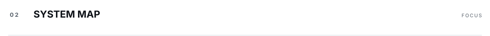
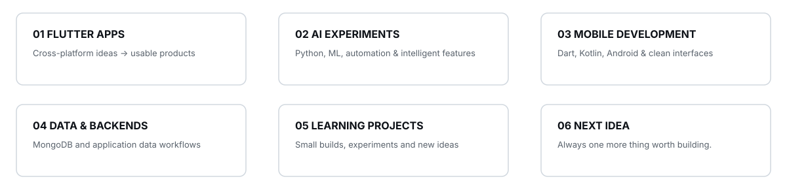
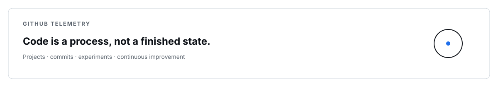
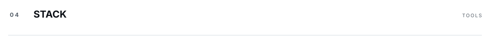
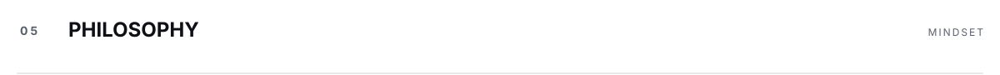
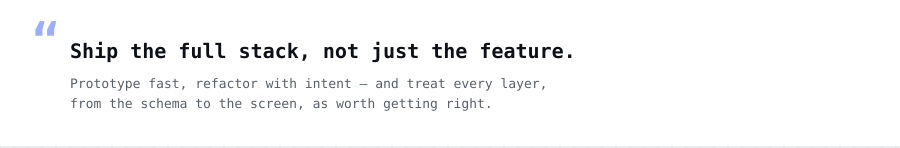

<picture>
  <source media="(prefers-color-scheme: dark)" srcset="assets/dark/header.svg"/>
  
</picture>

<a href="mailto:javohirabduvahhobov@gmail.com">
  <picture>
    <source media="(prefers-color-scheme: dark)" srcset="https://img.shields.io/badge/EMAIL-0d1117?style=flat-square"/>
    
  </picture>
</a>

<a href="https://github.com/javohir-io">
  <picture>
    <source media="(prefers-color-scheme: dark)" srcset="https://img.shields.io/badge/GITHUB-0d1117?style=flat-square&logo=github&logoColor=ffffff"/>
    
  </picture>
</a>

<picture>
  <source media="(prefers-color-scheme: dark)" srcset="assets/dark/s01.svg"/>
  
</picture>

<picture>
  <source media="(prefers-color-scheme: dark)" srcset="assets/dark/whoami.svg"/>
  
</picture>

<picture>
  <source media="(prefers-color-scheme: dark)" srcset="assets/dark/s02.svg"/>
  
</picture>

<picture>
  <source media="(prefers-color-scheme: dark)" srcset="assets/dark/ecosystem.svg"/>
  
</picture>

<picture>
  <source media="(prefers-color-scheme: dark)" srcset="assets/dark/s03.svg"/>
  
</picture>

<picture>
  <source media="(prefers-color-scheme: dark)" srcset="assets/dark/projects.svg"/>
  
</picture>

<picture>
  <source media="(prefers-color-scheme: dark)" srcset="assets/dark/github-stats.svg"/>
  
</picture>

<picture>
  <source media="(prefers-color-scheme: dark)" srcset="https://github-readme-activity-graph.vercel.app/graph?username=javohir-io&bg_color=00000000&color=ffffff&line=ffffff&point=ffffff&area_color=ffffff&area=true&hide_border=true&radius=0&custom_title=CONTRIBUTION%20TELEMETRY"/>
  
</picture>

<picture>
  <source media="(prefers-color-scheme: dark)" srcset="assets/dark/s04.svg"/>
  
</picture>

<picture>
  <source media="(prefers-color-scheme: dark)" srcset="assets/dark/stack.svg"/>
  
</picture>

<picture>
  <source media="(prefers-color-scheme: dark)" srcset="assets/dark/s05.svg"/>
  
</picture>

<picture>
  <source media="(prefers-color-scheme: dark)" srcset="assets/dark/philosophy.svg"/>
  
</picture>

<picture>
  <source media="(prefers-color-scheme: dark)" srcset="assets/dark/footer.svg"/>
  
</picture>

<!-- one responsive picture per visual; no duplicate light/dark rendering -->

