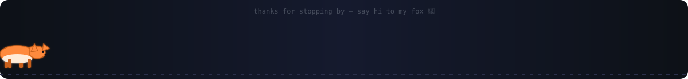

<div align="center">


&nbsp;


</div>



<div align="center">

</div>

I'm **Javohir Abduvahhobov**, a software engineer who builds full products end-to-end — mobile apps, REST APIs, the databases underneath them, and the web dashboards on top. My main project is a job-search platform built as a **Flutter** mobile app talking to a **Node.js/Express** API backed by **PostgreSQL**, plus a plain HTML/CSS/JS admin panel for managing everything behind the scenes.

Outside of that stack, I've also worked with **React + TypeScript** on the web, **Python**, **Kotlin**, and **C**, and studied **Machine Learning, Deep Learning, and Data Mining** at university.

```txt
const javohir = {
  role: "Mobile & Backend Engineer",
  focus: ["Flutter", "Node.js", "PostgreSQL", "REST APIs"],
  currentlyExploring: ["Machine Learning", "Deep Learning", "Data Mining"],
  motto: "ship it, then make it beautiful"
};
```


<div align="center">

</div>

Every ring below spins on its own — the inner badge is the anchor tech, the orbiting pills are everything built around it.

<div align="center">


</div>


<div align="center">

</div>

### 📱 Job-Search Platform (Flutter · Node.js · PostgreSQL)

A full job-search product I designed and built across every layer:

- **Mobile app (Flutter/Dart):** job browsing, saved jobs, applications, an interview calendar (`intl` for date formatting), resume/image uploads via `file_picker`, JWT session persistence with `shared_preferences`, and typography via `google_fonts`.
- **Backend (Node.js/Express):** JWT auth, `bcryptjs` password hashing, `multer` file uploads for resumes and images, `cors`, request logging with `morgan`, `uuid` for unique IDs, and a `pg` connection pool to PostgreSQL.
- **Database (PostgreSQL):** five core tables — `users`, `jobs`, `saved_jobs`, `applications`, `interviews`.
- **Admin panel:** plain HTML/CSS/JavaScript talking to the same REST API — no framework overhead.


<div align="center">


<br/>


<br/><br/>


<br/><br/>


<br/><br/>


</div>

> These widgets are generated live by third-party GitHub services on every page load — they'll always show your current numbers once this README is on `javohir-io/javohir-io`.


<div align="center">


<br/><br/>

<a href="mailto:javohirabduvahhobov@gmail.com">

</a>
&nbsp;
<a href="https://github.com/javohir-io">

</a>

</div>


