<picture>
  <source media="(prefers-color-scheme: dark)" srcset="assets/dark/header.svg">
  
</picture>

<a href="mailto:javohirabduvahhobov@gmail.com">
  <picture>
    <source media="(prefers-color-scheme: dark)" srcset="https://img.shields.io/badge/EMAIL-ffce6e?style=flat-square&labelColor=07070a">
    
  </picture>
</a>
<a href="https://github.com/javohir-io">
  <picture>
    <source media="(prefers-color-scheme: dark)" srcset="https://img.shields.io/badge/GITHUB-ffce6e?style=flat-square&logo=github&logoColor=07070a&labelColor=07070a">
    
  </picture>
</a>

 

<!-- 00 — IGNITION -->
<picture>
  <source media="(prefers-color-scheme: dark)" srcset="assets/dark/ignition.svg">
  
</picture>

<picture>
  <source media="(prefers-color-scheme: dark)" srcset="assets/dark/divider.svg">
  
</picture>

<!-- 01 — WHOAMI -->
<picture>
  <source media="(prefers-color-scheme: dark)" srcset="assets/dark/whoami.svg">
  
</picture>

<picture>
  <source media="(prefers-color-scheme: dark)" srcset="assets/dark/divider.svg">
  
</picture>

<!-- 02 — ECOSYSTEM / SYNAPSE MAP -->
<picture>
  <source media="(prefers-color-scheme: dark)" srcset="assets/dark/ecosystem.svg">
  
</picture>

<picture>
  <source media="(prefers-color-scheme: dark)" srcset="assets/dark/divider.svg">
  
</picture>

<!-- 03 — STACK -->
<picture>
  <source media="(prefers-color-scheme: dark)" srcset="assets/dark/stack.svg">
  
</picture>

<picture>
  <source media="(prefers-color-scheme: dark)" srcset="assets/dark/divider.svg">
  
</picture>

<!-- 04 — TRANSMISSION / CONTACT -->
<picture>
  <source media="(prefers-color-scheme: dark)" srcset="assets/dark/transmission.svg">
  
</picture>

<!-- SIGNAL — no audio plays on GitHub itself; the panel links out to Spotify where it actually does -->
<a href="https://open.spotify.com/track/5mkchG8YOueEJympSxy3Xx?si=aed57debf0d2493d">
<picture>
  <source media="(prefers-color-scheme: dark)" srcset="assets/dark/soundtrack.svg">
  
</picture>
</a>

<!-- FOOTER -->
<picture>
  <source media="(prefers-color-scheme: dark)" srcset="assets/dark/footer.svg">
  
</picture>
