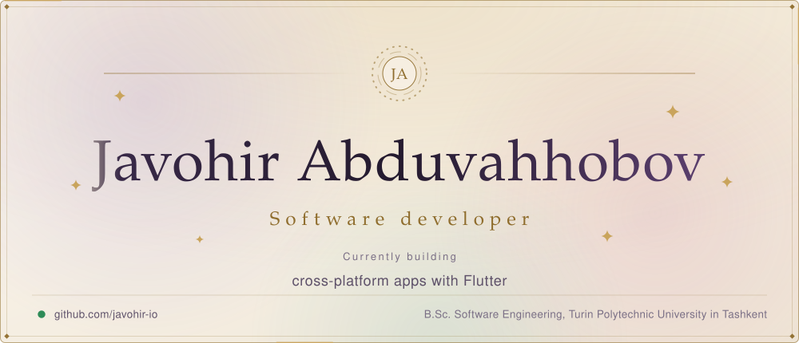
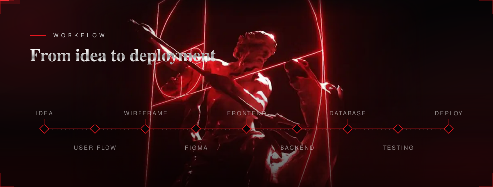
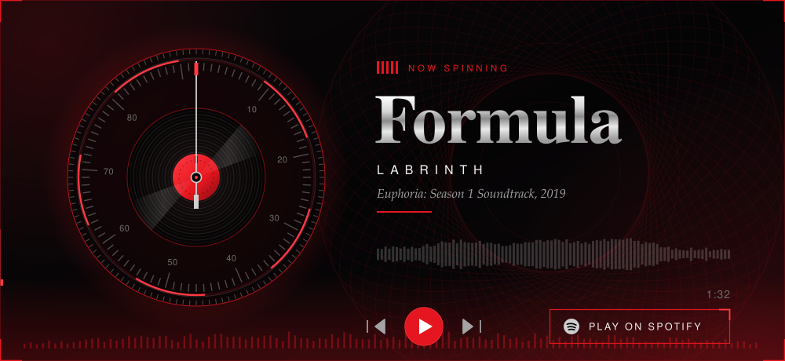
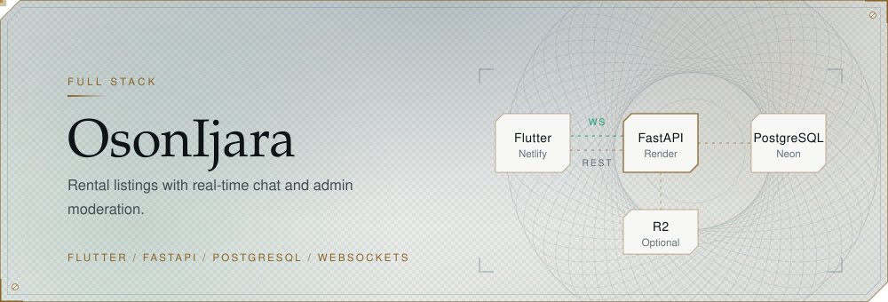
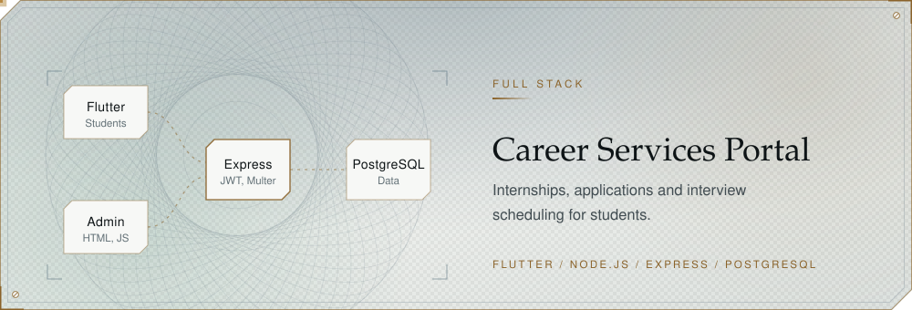
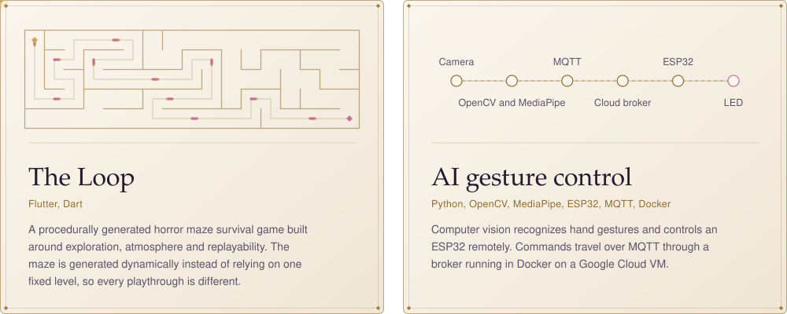
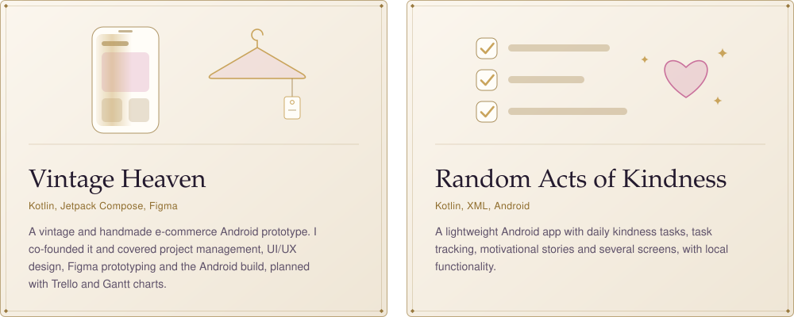
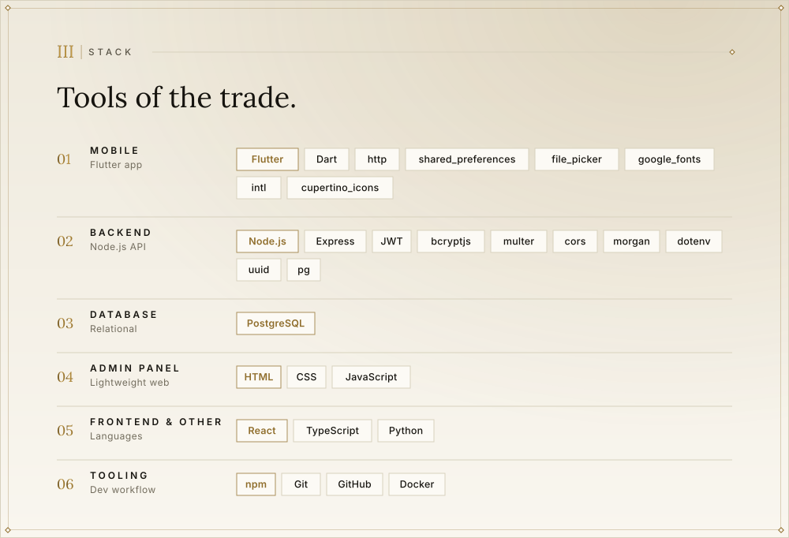
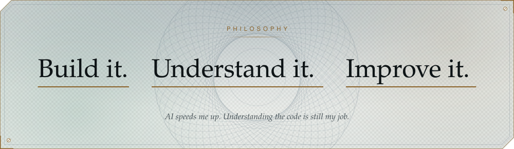

<picture>
    <source media="(prefers-color-scheme: dark)" srcset="assets/dark/header.svg">
    
  </picture>

 

<picture>
    <source media="(prefers-color-scheme: dark)" srcset="assets/dark/about.svg">
    
  </picture>

<picture>
    <source media="(prefers-color-scheme: dark)" srcset="assets/dark/divider.svg">
    
  </picture>

<picture>
    <source media="(prefers-color-scheme: dark)" srcset="assets/dark/workflow.svg">
    
  </picture>

<picture>
    <source media="(prefers-color-scheme: dark)" srcset="assets/dark/divider.svg">
    
  </picture>

<a href="https://open.spotify.com/track/6EtKlIQmGPB9SX8UjDJG5s">
  <picture>
    <source media="(prefers-color-scheme: dark)" srcset="assets/dark/player.svg">
    
  </picture>
</a>

GitHub can't play audio inside a README, so this is a live illustration. Click it to hear <b>Formula</b> by Labrinth on Spotify.

<picture>
    <source media="(prefers-color-scheme: dark)" srcset="assets/dark/divider.svg">
    
  </picture>

<picture>
    <source media="(prefers-color-scheme: dark)" srcset="assets/dark/project-osonijara.svg">
    
  </picture>

<picture>
    <source media="(prefers-color-scheme: dark)" srcset="assets/dark/project-career.svg">
    
  </picture>

<picture>
    <source media="(prefers-color-scheme: dark)" srcset="assets/dark/projects-1.svg">
    
  </picture>

<picture>
    <source media="(prefers-color-scheme: dark)" srcset="assets/dark/projects-2.svg">
    
  </picture>

<picture>
    <source media="(prefers-color-scheme: dark)" srcset="assets/dark/divider.svg">
    
  </picture>

<picture>
    <source media="(prefers-color-scheme: dark)" srcset="assets/dark/stack.svg">
    
  </picture>

<picture>
    <source media="(prefers-color-scheme: dark)" srcset="assets/dark/philosophy.svg">
    
  </picture>

<picture>
    <source media="(prefers-color-scheme: dark)" srcset="assets/dark/divider.svg">
    
  </picture>

<a href="mailto:javohir.abduvahhobov@gmail.com">
  <picture>
    <source media="(prefers-color-scheme: dark)" srcset="assets/dark/contact-email.svg">
    
  </picture></a>
<a href="https://github.com/javohir-io">
  <picture>
    <source media="(prefers-color-scheme: dark)" srcset="assets/dark/contact-github.svg">
    
  </picture></a>

 

<picture>
    <source media="(prefers-color-scheme: dark)" srcset="assets/dark/footer.svg">
    
  </picture>

