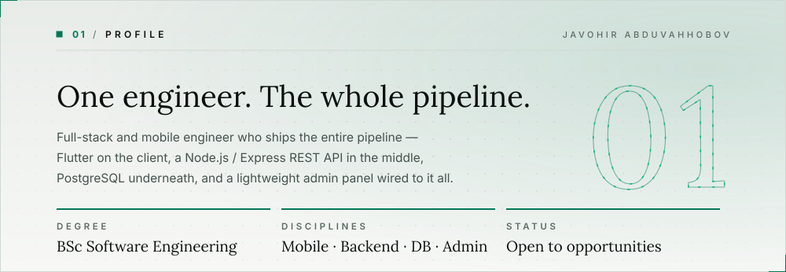
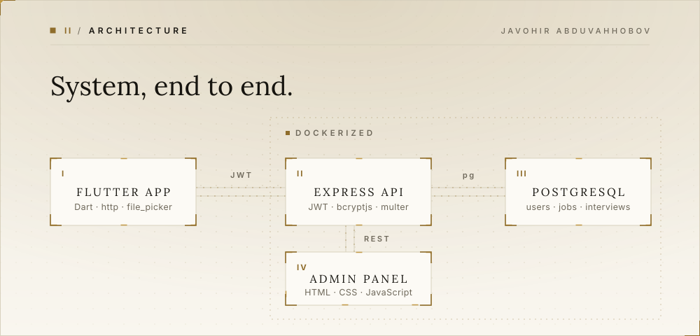
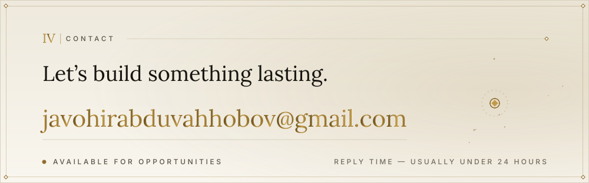
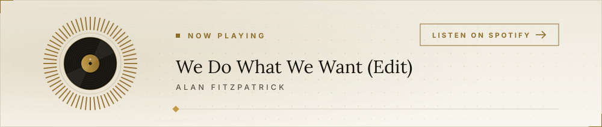

<!-- HERO -->
<a href="mailto:javohirabduvahhobov@gmail.com">
<picture>
  <source media="(prefers-color-scheme: dark)" srcset="assets/dark/header.svg">
  
</picture>
</a>

<picture>
  <source media="(prefers-color-scheme: dark)" srcset="assets/dark/divider.svg">
  
</picture>

<!-- I — PROFILE -->
<picture>
  <source media="(prefers-color-scheme: dark)" srcset="assets/dark/whoami.svg">
  
</picture>

<picture>
  <source media="(prefers-color-scheme: dark)" srcset="assets/dark/divider.svg">
  
</picture>

<!-- II — ARCHITECTURE -->
<picture>
  <source media="(prefers-color-scheme: dark)" srcset="assets/dark/ecosystem.svg">
  
</picture>

<picture>
  <source media="(prefers-color-scheme: dark)" srcset="assets/dark/divider.svg">
  
</picture>

<!-- III — STACK -->
<picture>
  <source media="(prefers-color-scheme: dark)" srcset="assets/dark/stack.svg">
  
</picture>

<picture>
  <source media="(prefers-color-scheme: dark)" srcset="assets/dark/divider.svg">
  
</picture>

<!-- IV — CONTACT (click to email) -->
<a href="mailto:javohirabduvahhobov@gmail.com">
<picture>
  <source media="(prefers-color-scheme: dark)" srcset="assets/dark/transmission.svg">
  
</picture>
</a>

<picture>
  <source media="(prefers-color-scheme: dark)" srcset="assets/dark/divider.svg">
  
</picture>

<!-- SOUNDTRACK — GitHub strips <audio>/<iframe>/JS from READMEs, so playback can't live in the page;
     the whole panel links out to the track on Spotify instead -->
<a href="https://open.spotify.com/track/2qGvgsRsmrB0Y7Y4MmuP1M">
<picture>
  <source media="(prefers-color-scheme: dark)" srcset="assets/dark/soundtrack.svg">
  
</picture>
</a>

<picture>
  <source media="(prefers-color-scheme: dark)" srcset="assets/dark/divider.svg">
  
</picture>

<!-- FOOTER -->
<picture>
  <source media="(prefers-color-scheme: dark)" srcset="assets/dark/footer.svg">
  
</picture>
